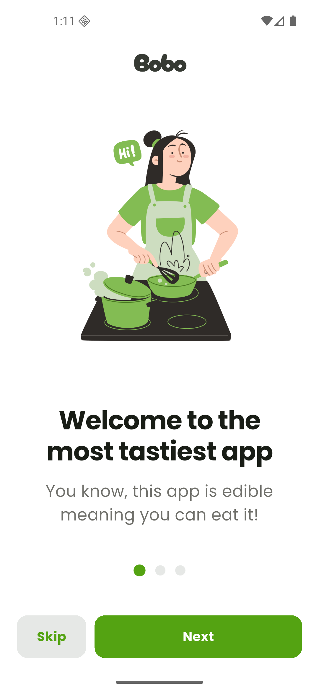
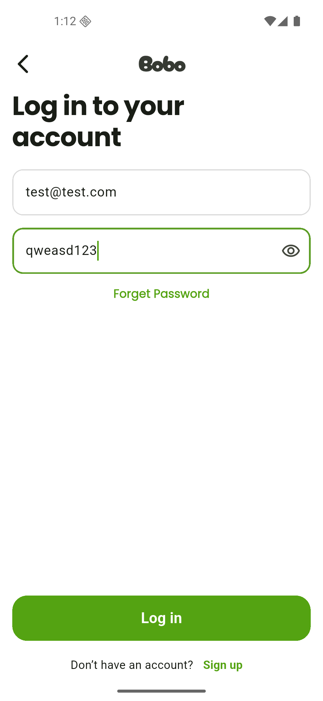
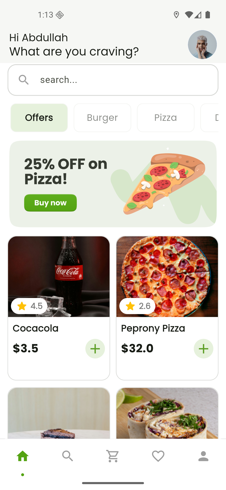
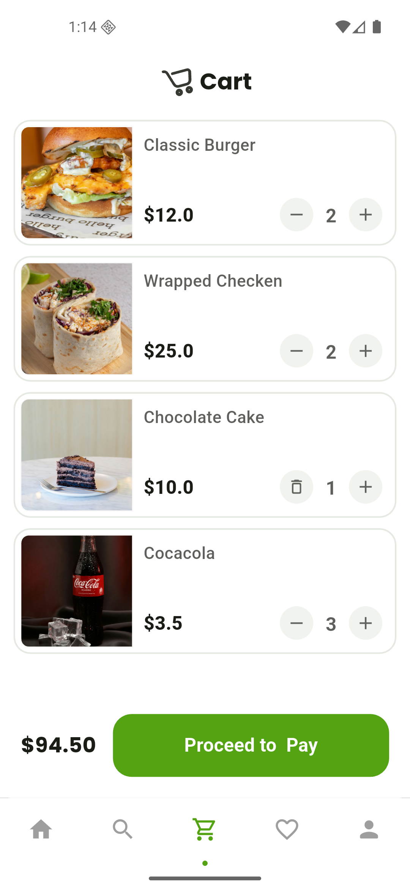
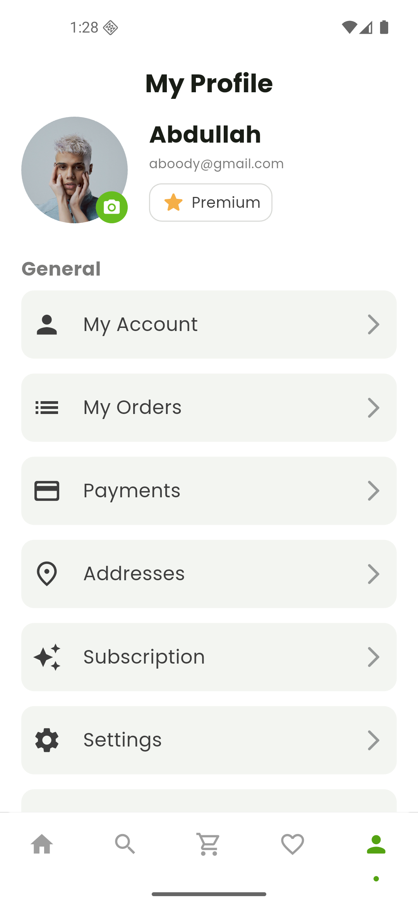

# 🍔 BoBo Delivery

<p align="center">
  
</p>

<h3 align="center">BoBo Delivery App</h3>

<p align="center">
  <strong>A premium, full-featured E-Commerce & Food Delivery application built with Flutter and Firebase.</strong>
</p>

<p align="center">
  
  
  
  
  
</p>

---

## 📖 Overview | نظرة عامة
**BoBo Delivery** is a modern e-commerce and food delivery app designed for maximum smoothness, visual excellence, and structured architecture. It utilizes **Flutter** for the frontend, **Firebase** for backend database and storage services, and **BLoC (Cubit)** pattern for state management.

تطبيق **BoBo Delivery** هو تطبيق حديث للتجارة الإلكترونية وتوصيل الطعام، تم تصميمه لتوفير أقصى درجات السلاسة والتميز البصري باتباع معايير هندسة البرمجيات النظيفة. يعتمد التطبيق على **Flutter** للواجهة الأمامية، و **Firebase** للخدمات السحابية وقاعدة البيانات، و **BLoC (Cubit)** لإدارة حالة التطبيق.

---

## ✨ Features | المميزات الرئيسية

- 🔐 **Secure Authentication System:**
  - Email & Password Registration/Login.
  - Interactive **OTP verification** flow for new accounts and password resets.
  - Stream-based login detection (`AuthGate`) to direct users seamlessly.

- 🛒 **Real-time Product Catalog:**
  - Syncs instantly with **Cloud Firestore**.
  - Dynamic category filters (Discover screen).
  - Premium loading experience using **Skeletonizer** for visual placeholder cards.

- 🛍️ **Cart & Interactive Checkout:**
  - Fast add/remove operations.
  - Multi-item calculations, discount coupon application support, and delivery details configuration.
  - Choose and manage addresses and payment cards on-the-fly.

- 📦 **Order Tracking & Management:**
  - Secure order creation linked directly to user profiles.
  - **My Orders** screen displaying history, prices, item counts, and status logs.

- ❤️ **Wishlist (Favorites):**
  - Instant favorite toggling with dynamic state feedback.

- 👤 **Profile Customization:**
  - Update account info, email, and phone numbers.
  - Upload/update profile pictures via **Firebase Storage** and native image picker.

- 🌗 **System-Wide Dark Mode:**
  - Native light/dark theme switching based on device settings, featuring elegant HSL-tailored colors.

---

## 🏗️ Architecture & Project Structure

This project follows **Clean Architecture & Feature-First Structure**, separating UI layouts, controllers, and data services for modularity and testability.

### Folder Tree

```text
lib/
├── controller/            # Business Logic & Repository Layers
│   ├── cart/              # Cart Cubit & actions
│   ├── favorite/          # Wishlist Cubit
│   ├── order/             # Order placement and retrieval repositories & Cubit
│   ├── product/           # Firestore product fetching & Cubit
│   └── user/              # User account sync repositories & Cubit
│
├── core/                  # Core modules & configurations
│   ├── components/        # Universal shared widgets
│   ├── consts/            # Colors, constants, routes, and custom themes
│   └── utils/             # Helper utilities
│
├── features/              # Feature-First UI Pages & Custom Widgets
│   ├── auth/              # Login, Sign Up, Forgot Password & OTP
│   ├── cart/              # Cart list, coupon applier, address selection, checkout
│   ├── discover_page/     # Category lists, search, and catalog page
│   ├── favorate/          # Wishlist screen
│   ├── home/              # Nav bar setup & home page layout
│   ├── my_orders/         # History of orders
│   ├── on_board/          # Onboarding and walkthrough screens
│   ├── products_details/  # Detail specs of food/product items
│   ├── profile/           # My account settings, addresses, payment forms, language
│   └── splash/            # Animated splash screen
│
├── services/              # External service configurations
├── firebase_options.dart  # Auto-generated Firebase platform config
└── main.dart              # Entrypoint of the app (MultiBlocProvider initialization)
```

---

## 🛠️ Technology Stack

- **Frontend:** [Flutter](https://flutter.dev) (v3.10.0+ required) & [Dart](https://dart.dev)
- **State Management:** [Flutter Bloc](https://pub.dev/packages/flutter_bloc) & Cubit
- **Backend:**
  - [Firebase Auth](https://firebase.google.com/products/auth) (Credentials & session state)
  - [Cloud Firestore](https://firebase.google.com/products/firestore) (Dynamic NoSQL storage)
  - [Firebase Storage](https://firebase.google.com/products/storage) (Media assets / profile avatars)
- **Core Dependencies:**
  - `skeletonizer` for beautiful placeholder skeleton loaders.
  - `flutter_screenutil` for responsive, pixel-perfect designs across varying screen ratios.
  - `cached_network_image` for smart network photo caching.
  - `awesome_dialog` for clean, animated custom action dialogs.
  - `flutter_otp_text_field` for the registration/forget password verify steps.

---

## 🚀 Getting Started

To get a local copy up and running, follow these steps:

### Prerequisites
- Flutter SDK `^3.10.0` installed.
- Firebase Console account.

### 1. Clone the Repo
```bash
git clone https://github.com/Aboody241/BoBo-Delivery.git
cd BoBo-Delivery
```

### 2. Install Packages
```bash
flutter pub get
```

### 3. Firebase Configuration
Ensure your project is registered on the Firebase Console:
1. Enable **Authentication** (Email/Password).
2. Enable **Firestore Database** and **Storage**.
3. Install Flutterfire CLI if you haven't:
   ```bash
   dart pub global activate flutterfire_cli
   ```
4. Run the configuration command in your project directory:
   ```bash
   flutterfire configure
   ```
   Select your Firebase project and platforms (Android, iOS). This will recreate/update `lib/firebase_options.dart`.

### 4. Running the Project
Connect an emulator or a physical device and run:
```bash
flutter run
```

---

## 📱 Screenshots (Placeholder)

| Onboarding | Login | Home Screen | Cart | Profile |
|:---:|:---:|:---:|:---:|:---:|
|  |  |  |  |  |

---

## 🤝 Contributing

Contributions make the open-source community an amazing place to learn, inspire, and create.
1. Fork the Project.
2. Create your Feature Branch (`git checkout -b feature/AmazingFeature`).
3. Commit your Changes (`git commit -m 'Add some AmazingFeature'`).
4. Push to the Branch (`git push origin feature/AmazingFeature`).
5. Open a Pull Request.

---

## 📄 License
This project is licensed under the MIT License - see the LICENSE file for details.
