# تقرير التدقيق الفني والهندسي الشامل لمشروع BoBo Delivery
**إعداد: Senior Flutter Architect & Lead QA Engineer**
**التاريخ: 2026-05-29**

---

## 1. تحليل البنية الهندسية وتدقيق الهيكل (Architecture Analysis)

### أ. تحليل الهيكل العام وتنظيم الملفات (Folder & File Structure)
يتبع المشروع نمط **Feature-First Architecture** (الهيكلية القائمة على الميزات)، وهي هيكلية ممتازة للمشاريع متوسطة وكبيرة الحجم. يتم تقسيم الميزات تحت مجلد `lib/features/` بشكل مستقل، مما يسهل التطوير المتوازي والصيانة.

```
lib/
├── controller/         # إدارة الحالة المشتركة (Cart, Favorite)
├── core/               # المكونات الأساسية المشتركة، الألوان، الخطوط، والمكونات العامة
│   ├── components/
│   ├── consts/
│   │   ├── pages/      # ثغرة هيكلية: تحتوي على ملفات صفحات يجب أن تكون داخل الميزات!
│   │   ├── routes/
│   │   ├── theme/
│   │   └── widgets/
├── features/           # الميزات المستقلة (Auth, Home, Cart, Discover, etc.)
├── services/           # الخدمات الخارجية (Firebase Auth)
└── main.dart           # نقطة الدخول للتطبيق
```

### ب. جودة تقسيم الطبقات (Layers Evaluation)
* **طبقة الواجهات (UI Layer):** جيدة ومقسمة إلى `pages/` و `widgets/` داخل كل ميزة.
* **طبقة البيانات (Data/Service Layer):** متوفرة بشكل ضعيف. بعض الخدمات مدمجة مباشرة داخل واجهات المستخدم (مثل جلب المنتجات في `home_products_list.dart`) أو مبعثرة بين مجلدات `services/` في الجذر ومجلدات `service/` داخل الميزات.
* **طبقة إدارة الحالة (Business Logic Layer):** يتم استخدام **Cubit** من فصل الأعمال عن الواجهات بصورة جيدة في المفضلة والسلة، لكنها تعاني من بعض التداخل البرمجي داخل شاشات تسجيل الدخول والتوثيق.

### ج. نقاط القوة والضعف والـ Anti-Patterns
* **نقاط القوة (Strengths):**
  * هيكلية واضحة ومقروءة للمطورين الجدد.
  * فصل متميز للمكونات المرئية المشتركة في `core/consts/widgets`.
* **نقاط الضعف (Weaknesses):**
  * **تشتيت ملفات الصفحات:** وضع شاشة مثل `VerfiyOTPNewAccountScreen` داخل `lib/core/consts/pages/` يعد انتهاكاً لنمط *Feature-First*، حيث كان يجب وضعها داخل ميزة `auth` أو `signup`.
  * **الكود الميت (Dead Code):** وجود ويدجت `ProductsCards` في `lib/features/home/widgets/products_cards.dart` وهي غير مستخدمة تماماً في أي مكان، حيث تعتمد الصفحة الرئيسية على `HomeProductsList` عوضاً عنها.
* **الأنماط المضادة (Anti-Patterns):**
  * **بيانات ثابتة (Hardcoding):** واجهات المستخدم مليئة بنصوص وصور ثابتة تحاكي الوظائف الحقيقية (مثل اسم المستخدم دانيال جونز، عدادات الـ OTP، تبديل وضع الليل).
  * **غياب الفصل التام للمسؤوليات (SRP Violation):** شاشات الـ OTP تحتوي على منطق التحكم بالوقت (Timer)، والواجهة، ومنطق محاكاة التحقق في ملف واحد.

---

## 2. تحليل نظام إدارة الحالة (State Management Analysis)

التطبيق يعتمد على **Flutter Bloc (Cubit)** لإدارة الحالات المشتركة وهو خيار ذكي ومثالي لهذه الفئة من التطبيقات.

### أ. فحص الـ Cubits الحالية
1. **`CartCubit` (`cart_cubit.dart`):**
   * **الحالة (State):** يتم استخدام `List<CartItem>` كحالة مباشرة.
   * **العمليات:** نظيفة وتغطي الإضافة، التنقيص، الحذف والتفريغ.
   * **الثغرة المنطقية:** لا يتم تخزين السلة محلياً (باستخدام Hive أو SharedPreferences)، مما يعني أنه بمجرد إغلاق التطبيق أو إعادة تشغيله، تضيع محتويات السلة بالكامل!
2. **`FavoriteCubit` (`favorite_cubit.dart`):**
   * **الحالة (State):** يتم استخدام `List<Product>` كحالة مباشرة.
   * **الثغرة:** الـ Cubit يستورد حزم `bloc` و `meta` بشكل مستقل، ولكن هذه الحزم غير مضافة في ملف `pubspec.yaml` كاعتماد مباشر (تُجلب بشكل غير مباشر عبر `flutter_bloc`)، مما يتسبب في تحذير فحص الكود `depend_on_referenced_packages`.

### ب. الأداء وإعادة البناء غير الضرورية (Unnecessary Rebuilds)
* **Rebuilds في صفحة السلة:** يتم استدعاء `BlocBuilder<CartCubit, List<CartItem>>` في أعلى الشجرة داخل `cart_page.dart`. هذا يتسبب في **إعادة بناء الشاشة بالكامل** (بما في ذلك شريط العنوانAppBar، والأزرار السفلية، وواجهة السلة الفارغة) مع كل عملية زيادة أو نقصان لكمية منتج واحد!
  * *التصحيح الموصى به:* وضع الـ `BlocBuilder` بشكل مخصص فقط حول قائمة المنتجات (`SliverList`) وعداد السعر الإجمالي لمنع اهتزاز الشاشة وضياع الأداء.
* **مقارنة مرجعية للحالات:** الحالات المنبعثة عبارة عن قوائم عادية وليست كائنات غير قابلة للتغيير (Immutable) تستخدم `Equatable`. هذا يعني أن فلاتر قد تقوم بإعادة بناء العناصر حتى لو لم تتغير البيانات فعلياً.

---

## 3. تكامل Firebase والعمليات الخلفية (Firebase & Backend Integration)

التطبيق يتصل بـ Firebase للتوثيق وجلب البيانات، ولكن هذا الاتصال **مكتمل جزئياً فقط** وبه ثغرات منطقية خطيرة:

### أ. فحص التوثيق (Firebase Auth)
* **المكتمل:** عمليتي تسجيل الدخول الفعلي وإنشاء الحساب الأساسي بالبريد وكلمة المرور تعمل وتتصل بالخادم بشكل صحيح.
* **غير المكتمل والمكسور منطقياً:**
  1. **تسجيل الدخول السريع (Google & Apple):** الأزرار معطلة ولا تحتوي على أي منطق اتصال (`onTap: () {}`).
  2. **صفحة إنشاء الملف الشخصي (`CreateProfileScreen`):** بمجرد نجاح تسجيل الحساب الجديد، يتم توجيه المستخدم لصفحة إنشاء الملف (الاسم، الهاتف، الميلاد، الصورة، العنوان). يدخل المستخدم البيانات ويضغط استمرار، لكن التطبيق **لا يحفظ هذه البيانات في أي مكان!** لا يتم تحديث الـ `displayName` في Firebase Auth، ولا يتم إنشاء مستند للمستخدم في Firestore. يتم فقط توجيهه للرئيسية وتضيع البيانات تماماً!
  3. **استعادة كلمة المرور (`ResetPasswordScreen`):** الشاشة مصممة وتتحقق من تطابق كلمتي المرور، ولكن الضغط على زر التأكيد لا يتصل بـ Firebase لتغيير كلمة المرور فعلياً! إنها مجرد حركة واجهة تنقل المستخدم للشاشة الرئيسية.
  4. **التحقق من الـ OTP (Simulated OTP):** شاشات الـ OTP لا ترسل أي كود حقيقي، والعداد ثابت على `00:00` وزر إعادة الإرسال فارغ. يتم قبول أي إدخال بعد ملء 4 خانات ويتم إظهار رسالة نجاح وهمية.

### ب. فحص قاعدة البيانات (Cloud Firestore)
* **هيكل البيانات (Collections):**
  * يتم جلب المنتجات من مجموعة `products`.
  * يتم جلب التصنيفات من مجموعة `Discover_categories`.
* **ثغرات القراءة والكتابة (Firestore Gaps):**
  * **خطأ إملائي في قاعدة البيانات (Typo in JSON Mapping):** في ملف `discover_category_class.dart` السطر 8:
    `child: json['chlid'] ?? '',`
    تم كتابة المفتاح `'chlid'` بدلاً من `'child'`. هذا يعني أنه إذا تم إصلاح قاعدة البيانات مستقبلاً وتعديل الاسم الإملائي الصحيح، ستختفي الصور من التطبيق فوراً!
  * **كفاءة الاستهلاك (Read Efficiency):** في صفحة الاستكشاف (`DiscoverScreen`) يتم استخدام `snapshots()` (Stream) لجلب التصنيفات. هذا يعني فتح اتصال دائم ومستمر لقراءة التصنيفات التي هي بطبيعتها بيانات شبه ثابتة لا تتغير كل ثانية. هذا يتسبب في **استهلاك هائل للـ Reads** ورفع تكاليف Firebase بدون أي فائدة حقيقية.
    * *التصحيح الموصى به:* استبدالها بـ `.get()` (Future) لجلب البيانات لمرة واحدة عند فتح الصفحة.

---

## 4. فحص واكتمال الميزات وتصنيف الأولويات (Feature Completion Audit)

قمنا بفحص كل شاشة وميزة على حدة، وتصنيف حالتها التشغيلية وتحديد مدى جاهزيتها للـ Production:

```mermaid
gantt
    title مدى جاهزية الميزات للعمل الفعلي (Production Readiness)
    dateFormat  X
    axisFormat %I
    
    section مكتملة وجاهزة
    شاشة الترحيب والـ Onboarding      :active, 0, 100
    شاشة المفضلة (Favorites)          :active, 0, 95
    سلة المشتريات كـ Logic            :active, 0, 90
    
    section بحاجة لإصلاحات عاجلة
    ربط سلة شاشة التفاصيل             :crit, 0, 10
    تفريغ السلة وحفظ الطلب            :crit, 0, 15
    حفظ بيانات المستخدم الجديد          :crit, 0, 20
    
    section غير مكتملة / واجهة فقط
    صفحة الطلبات (My Orders)          :milestone, 0, 0
    وضع الليل (Dark Mode)             :milestone, 0, 5
    شريط البحث والفلترة               :milestone, 0, 10
```



### كشف تفصيلي لحالة الميزات ومستوى أهميتها:

1. **إضافة المنتج للسلة من صفحة التفاصيل (`ProductDetailScreen`):**
   * **الحالة:** ❌ **تالفة منطقياً (Broken Logic)**. يمكنك اختيار الكميات وتعديلها وحساب السعر الإجمالي، ولكن زر "Add to cart" في الأسفل معطل ولا يضيف أي شيء للسلة!
   * **الأهمية:** 🔥 **حرجة جداً (Critical)**. بدونها لا يمكن للمستخدم شراء منتج بعد قراءة تفاصيله.

2. **تفريغ السلة وتسجيل الطلبات عند الشراء (`Checkout & Order Submission`):**
   * **الحالة:** ❌ **تالفة منطقياً (Broken Logic)**. عند إدخال العنوان والضغط على "Submit Order" تظهر شاشة النجاح، ولكن السلة تظل مليئة بالمنتجات ولا يتم مسحها، كما لا يتم كتابة الطلب في Firestore أو أي مكان.
   * **الأهمية:** 🔥 **حرجة جداً (Critical)**.

3. **حفظ بيانات الملف الشخصي في قاعدة البيانات (`CreateProfileScreen`):**
   * **الحالة:** ❌ **واجهة فقط (UI Only)**. لا يتم حفظ بيانات الاسم والهاتف والعنوان بعد التسجيل.
   * **الأهمية:** 🟥 **مرتفعة (High)**.

4. **ربط وتفعيل شاشة الطلبات السابقة (`MyOrdersScreen`):**
   * **الحالة:** ❌ **غير منفذة تماماً (Unimplemented)**. تعرض ويدجت `Placeholder()` فقط.
   * **الأهمية:** 🟥 **مرتفعة (High)**.

5. **أزرار التسجيل السريع واستعادة كلمة المرور الفعالة:**
   * **الحالة:** ❌ **واجهة فقط (UI Only)**.
   * **الأهمية:** 🟧 **متوسطة (Medium)**.

6. **تفعيل فلترة التصنيفات والبحث الفعلي:**
   * **الحالة:** ❌ **واجهة فقط (UI Only)**. الضغط على تصنيفات الصفحة الرئيسية (`Burger`, `Pizza`, etc.) أو الكتابة في شريط البحث لا يفلتر المنتجات.
   * **الأهمية:** 🟧 **متوسطة (Medium)**.

7. **زر وضع الليل الفعلي (Dark Mode):**
   * **الحالة:** ❌ **واجهة فقط (UI Only)**. الزر ثابت القيمة ولا يغير ثيم التطبيق.
   * **الأهمية:** 🟨 **منخفضة (Low)**.

---

## 5. تحليل رحلة المستخدم والتجربة المنطقية (User Flow & UX Audit)

تم اختبار مسارات المستخدم الفعلية (User Journeys) ورصد العوائق المنطقية التي تؤدي إلى طرق مسدودة (Dead Ends) أو تجربة مستخدم مكسورة:

```
[التسجيل بنجاح] ➔ [شاشة إنشاء الملف الشخصي] ➔ ⚠️ (إغلاق التطبيق فجأة) ➔ [إعادة فتح التطبيق] ➔ ❌ [تخطي إنشاء الملف والدخول مباشرة للرئيسية ببيانات فارغة!]
```

### أ. ثغرة تدفق المصادقة عند التسجيل (Auth Flow Bug)
عندما يقوم مستخدم جديد بالتسجيل، يتم إنشاء الحساب في Firebase Auth فوراً ثم توجيهه لشاشة `CreateProfileScreen`. 
* **المشكلة الكبرى:** إذا قام المستخدم بإغلاق التطبيق في هذه اللحظة قبل ملء بياناته، ثم فتحه مجدداً؛ فإن الـ `AuthGate` سيتعرف عليه كمستخدم مسجل دخول (لأن الحساب تم إنشاؤه في الخطوة الأولى)، وسيقوم بتوجيهه **مباشرة إلى الصفحة الرئيسية** متخطياً شاشة إنشاء الملف الشخصي إلى الأبد!
* **النتيجة:** مستخدم داخل التطبيق بملف شخصي فارغ تماماً وبدون اسم أو هاتف، مما يعطل عمليات التوصيل والدفع.
* **الحل:** يجب ربط حالة تسجيل الدخول بوجود مستند للمستخدم في Firestore، وإذا لم يكن موجوداً، يتم توجيهه إجبارياً لشاشة إنشاء الملف الشخصي.

### ب. الطرق المسدودة وتجربة الواجهة (Dead Ends & UX Issues)
* **الوصول لصفحة الطلبات:** عند الضغط على "My Orders" من الملف الشخصي، يجد المستخدم نفسه في شاشة رمادية فارغة (`Placeholder`) ولا توجد طريقة للعودة سوى إغلاق التطبيق أو استخدام زر الرجوع الخاص بالنظام لعدم وجود AppBar أو زر رجوع مصمم في الصفحة!
* **السلايدر الإعلاني أحادي الصورة:** يحتوي السلايدر على نقاط مؤشر السفلي (Dots Indicator)، ولكن لا توجد سوى صورة واحدة ثابتة، مما يعطي انطباعاً بأن التطبيق متوقف عن الاستجابة عند محاولة سحب الصورة لعرض بقية الإعلانات.

---

## 6. تقييم التصميم والواجهات الاحترافية (UI/UX Review)

### أ. المظهر الجمالي المتميز (Premium Visuals)
* **الألوان:** اختيار باليت ألوان متناسق وجميل جداً يعبر عن هوية التطبيق (الأخضر العشبي الدافئ والرماديات الناعمة).
* **الخطوط:** استخدام خط Poppins المتميز يعطي لمسة جمالية وعصرية استثنائية للواجهات.
* **تأثيرات التحميل (Loading States):** ممتازة جداً بفضل استخدام **Skeletonizer** في الصفحة الرئيسية بدلاً من مؤشرات التحميل الدائرية التقليدية والمملة.

### ب. المكونات المفقودة والتحسينات المطلوبة
* **غياب الدعم الحقيقي للـ Dark Mode:** بالرغم من كتابة ثيم مخصص للوضع المظلم في `main.dart` وتحديد الألوان، إلا أن زر التبديل في الإعدادات غير مربوط بنظام إدارة الثيم الفعلي للتطبيق.
* **المساحات الفاصلة الخطيرة (Dangerous Spacing):**
  * في ملف `check_address_screen.dart` تم وضع مسافة فاصلة ثابتة:
    `Gap(500)`
    هذه القيمة الثابتة الكبيرة جداً **ستتسبب فوراً في انهيار الشاشة وظهور علامة الخطأ الصفراء (RenderFlex overflow)** على أي هاتف ذكي ذو شاشة متوسطة أو صغيرة (مثل هواتف iPhone SE أو شاشات 5.5 بوصة).
    * *التصحيح الموصى به:* استبدالها بـ `Spacer()` أو استخدام `LayoutBuilder` لحساب المساحة الديناميكية.

---

## 7. فحص جودة وجودة الكود والتحذيرات (Code Quality & Warnings)

### أ. الأخطاء الإملائية وتسمية الملفات
* **تسمية الكلاسات:** كلاس `OrederSubmited` (خطأ إملائي مزدوج، الأصح هو `OrderSubmitted`).
* **تسمية الملفات:** ملف `verfieOPTpage.dart` (الأصح هو `verify_otp_page.dart` تماشياً مع قواعد Dart في التسمية بصيغة snake_case). وملف `verfiy_OPT_NewAccount.dart` (الأصح `verify_otp_new_account.dart`).
* **تسمية المتغيرات في الموديلات:** استخدام اختصار `disc` بدلاً من الاسم الكامل `description` في الموديل يقلل مقروئية الكود.

### ب. المشاكل البرمجية والتحذيرات الفعالة (15 تحذيراً برمجياً)
رصدت أداة التحليل (`flutter analyze`) مشاكل يجب تنظيفها بالكامل لضمان استقرار التطبيق:
1. **استدعاء الـ BuildContext بشكل غير آمن (use_build_context_synchronously):**
   في ملف `login_page_screen.dart` وملف `create_account_screen.dart` وملف `general_setting_widget.dart` (عند تسجيل الخروج)، يتم استدعاء عمليات التوجيه `Navigator.push` مباشرة بعد عمليات الـ `await` للخدمات دون التحقق من أن الواجهة لا تزال معروضة.
   * *مثال للخطأ:*
     ```dart
     await auth.loginUser(...);
     Navigator.pushReplacementNamed(context, ...); // خطأ قد يسبب انهيار التطبيق إذا أغلق المستخدم الشاشة أثناء التحميل!
     ```
   * *التصحيح:*
     ```dart
     await auth.loginUser(...);
     if (!context.mounted) return;
     Navigator.pushReplacementNamed(context, ...);
     ```
2. **استخدام مكتبات قديمة (Deprecated APIs):**
   استخدام `.withOpacity` لتعديل ألوان الخلفيات والأيقونات. هذه الميزة تم الاستغناء عنها برمجياً في إصدارات فلاتر الحديثة، ويجب استبدالها بـ `.withValues(alpha: ...)` لتفادي مشاكل الألوان مستقبلاً.

---

## 8. تحليل الأداء والاستهلاك (Performance Analysis)

### أ. استهلاك الذاكرة وجودة الصور (Image Memory Optimization)
* **نقطة تميز هندسية رائعة:** استخدام `CachedNetworkImage` مع تحديد قيم `memCacheWidth` و `memCacheHeight` (مثل 400 في الصفحة الرئيسية و 500 في المفضلة). هذه ممارسة ممتازة جداً تمنع فلاتر من فك تشفير الصور بجودتها الكاملة الكبيرة وتخزينها في الذاكرة العشوائية (RAM)، مما يحمي التطبيق من مشاكل الـ **Out of Memory Crashes**.

### ب. مشاكل وبطء حركات الأنميشن (Slow Animations)
* في كرت المنتجات الخاص بالسلة (`produt_cart_item.dart`) السطر 148:
  ```dart
  AnimatedDefaultTextStyle(
    ...
    duration: Duration(seconds: 4), // بطيء جداً!
    curve: Curves.bounceIn,
    child: Text('$quantity'),
  )
  ```
  تم تحديد مدة الأنميشن لتغيير رقم الكمية لتكون **4 ثوانٍ كاملة** مع انحناء حركي مرتد! هذا يجعل التطبيق يبدو بطيئاً جداً ومثيراً للغضب عند ضغط المستخدم على زر "+" أو "-" حيث يستغرق الرقم 4 ثوانٍ ليستقر في مكانه.
  * *التصحيح الموصى به:* تعديل المدة لتكون `Duration(milliseconds: 300)` مع حركة ناعمة مثل `Curves.easeOut`.

---

## 9. تحليل الحماية والاستقرار البرمجي (Security & Stability Audit)

* **التحقق من صحة المدخلات (Form Validation):**
  * الواجهات تتحقق فقط من عدم فراغ النصوص واحتواء البريد على علامة `@` وطول كلمة المرور > 5. 
  * غياب الفحص الدقيق بالـ Regex للتحقق من صياغة الإيميل الحقيقية وصعوبة كلمة المرور وقوة رقم الهاتف المدخل في شاشة إنشاء الملف الشخصي.
* **إدارة الاستثناءات (Exception Handling):**
  * وظائف الـ Auth مغلفة بـ `try-catch` بشكل ممتاز وتعرض الأخطاء في وجوه المستخدمين عبر الـ SnackBar.
  * **خطورة انهيار التطبيق في جلب المنتجات:** دالة `getProducts()` تجلب البيانات من Firestore وتمررها مباشرة دون أي `try-catch`. إذا حدث انقطاع في الشبكة أو كان هناك حقل واحد مفقود أو مكتوب بنوع بيانات خاطئ في مستند المنتج على قاعدة البيانات (مثل سعر المنتج مكتوب كـ String بدلاً من double)، سيتوقف التطبيق عن العمل تماماً ويعرض شاشة الخطأ الحمراء العامة لكافة المستخدمين.

---

## 10. التقرير النهائي والتقييم الاحترافي للمشروع

### أ. التقييم العددي لجاهزية التطبيق للعمل الفعلي (Production Scorecard)

| البعد التقني والهندسي | التقييم (من 10) | التفسير الهندسي للتقييم |
| :--- | :---: | :--- |
| **هندسة الكود والهيكل (Architecture)** | **7.5 / 10** | هيكلية الميزات ممتازة، ولكن هناك تشتت لبعض الشاشات ووجود كود ميت. |
| **تصميم واجهة وتجربة المستخدم (UI/UX)** | **8.0 / 10** | جمالية استثنائية وألوان متناسقة، لكن تعطل وضع الليل والمساحات الخطرة يقلل التقييم. |
| **إدارة الحالة (State Management)** | **7.5 / 10** | استخدام Cubit موفق، ولكن يعاب عليه إعادة بناء عناصر الشاشة بالكامل وعدم الحفظ المحلي. |
| **كفاءة الأداء وسرعة الاستجابة (Performance)** | **8.5 / 10** | ممارسات ممتازة في كاش الصور وحجم الذاكرة، مع وجود بطء أنميشن عداد السلة. |
| **قابلية التوسع والمستقبلية (Scalability)** | **7.0 / 10** | التطبيق قابل للتوسع بسهولة، لكنه يحتاج لفصل طبقة الخدمات (Services) عن الـ UI. |
| **حماية واستقرار النظام (Security & Stability)** | **6.5 / 10** | غياب التحقق الصارم من المدخلات، ومخاطر الانهيار لغياب معالجة أخطاءFirestore للبيانات. |
| **جاهزية النشر الفعلي (Production Readiness)** | **5.5 / 10** | التطبيق واعد جداً، ولكنه **غير جاهز للنشر الفعلي حالياً** لوجود ميزات رئيسية معطلة كلياً (مثل زر الشراء). |

---

### ب. خطة الطريق التقنية لإصلاح وتطوير المشروع (Priority Roadmap)

قمنا بترتيب المهام الهندسية حسب مستوى الأهمية والخطورة لتسهيل عملية البدء الفوري في التطوير والتحسين:

```mermaid
graph TD
    classDef crit color:#fff,fill:#d9534f,stroke:#d43f3a;
    classDef high color:#fff,fill:#f0ad4e,stroke:#eea236;
    classDef med color:#fff,fill:#5bc0de,stroke:#46b8da;
    classDef low color:#fff,fill:#5cb85c,stroke:#4cae4c;

    T1[1. تفعيل زر الإضافة للسلة بصفحة التفاصيل]:::crit ➔ T2[2. تفريغ السلة عند إتمام الطلب الشراء]:::crit
    T2 ➔ T3[3. إصلاح وحفظ بيانات الملف الشخصي بـ Firestore]:::high
    T3 ➔ T4[4. إكمال صفحة الطلبات السابقة وتصميمها]:::high
    T4 ➔ T5[5. إصلاح مشكلة ثغرة تدفق الـ Auth الفراغية]:::high
    T5 ➔ T6[6. تفعيل فلترة المنتجات حسب التصنيفات والبحث]:::med
    T6 ➔ T7[7. معالجة وتعديل أخطاء الـ analyze والسرعة والـ Typos]:::low
```

#### 🚨 أولاً: أولويات حرجة وعاجلة جداً (Critical Priority) - يجب البدء بها فوراً
1. **ربط تفاصيل المنتج بالـ Cart:** تعديل ملف `product_detail_screen.dart` وربط زر "Add to cart" السكني بـ `context.read<CartCubit>().addItem(...)` مع تمرير المنتج بالكمية المختارة `productNum`.
2. **تطهير وتفريغ السلة بعد إرسال الطلب:** تعديل ملف `check_address_screen.dart` لاستدعاء دالة `clearCart()` في Cubit السلة عند نجاح إرسال الطلب لمنع بقاء السلة ممتلئة بعد الدفع.

#### 🟧 ثانياً: أولويات مرتفعة الأهمية (High Priority) - تؤثر مباشرة على تجربة المستخدم
3. **حفظ بيانات المستخدم الجديد:** إنشاء مستند للمستخدم في Firestore تحت مجموعة `users` عند إكمال شاشة `CreateProfileScreen` يحتوي على الاسم، رقم الهاتف، تاريخ الميلاد، ورابط الصورة الشخصية.
4. **تطوير شاشة الطلبات (`MyOrdersScreen`):** بناء الواجهة البرمجية للشاشة الفراغية وجلب وعرض الطلبات الفعلية التي يقوم المستخدم بإرسالها.
5. **معالجة ثغرة تدفق الـ Auth:** تعديل الـ `AuthGate` ليتحقق من اكتمال مستند المستخدم في Firestore قبل السماح له بالولوج المباشر للصفحة الرئيسية للتأكد من عدم وجود حسابات بدون ملف شخصي.

#### 🟦 ثالثاً: أولويات متوسطة الأهمية (Medium Priority)
6. **فلترة المنتجات والبحث الفعلي:** تعديل الـ `HomeProductsList` وربطه بالـ `selectedCategoryIndex` لتحديث قائمة المنتجات ديناميكياً وعرض المنتجات التابعة للقسم المختار فقط، وربط حقل البحث البرمجي بفلترة القائمة.
7. **إصلاح المساحة الخطرة `Gap(500)`:** استبدالها بمسافات مرنة مثل `Spacer` لمنع انهيار وتداخل الواجهات على الهواتف الذكية ذات الشاشات الصغيرة.

#### 🟩 رابعاً: أولويات منخفضة الأهمية (Low Priority)
8. **تنظيف الكود الميت وتصحيح التسميات الإملائية:** إزالة ملف `products_cards.dart` غير المستخدم، وإعادة تسمية الكلاسات الخاطئة مثل `OrederSubmited` إلى `OrderSubmitted` وتصحيح أسماء الملفات وتنبيهات أداة التحليل `flutter analyze` بالكامل.
9. **تسريع أنميشن عداد السلة:** تعديل مدة الحركة في `produt_cart_item.dart` من 4 ثوانٍ إلى 300 مللي ثانية ليعطي إحساساً بالخفة والاستجابة اللحظية.

---
**نهاية التقرير الفني.**
